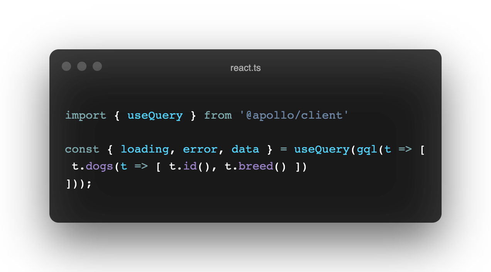

# TQL

> Note: this is **pre-production software** at this point, see the **[current limitations](./CURRENT_LIMITATIONS.md)**.

**tql** is a TypeScript GraphQL query builder.

- **Codegen once** - regenerate your GraphQL API client only when your schema changes.
- **Fully type-safe** - take advantage of the full power of TypeScript's advanced type-system.
- **Backendless** - integrate with any existing GraphQL client.

## [Try it Out](https://repl.it/@timkendall/TQL-Starwars)

Try out our pre-compiled Star Wars GraphQL client on [Repl.it](https://repl.it/)! 



## Quickstart

1. [Installation](#installation)
1. [Usage](#usage)
    1. [(Option 1) Static Selectors]()
    1. [(Option 2) Dynamic Selectors]()
    1. [Basics](#basics)
        1. [Operations](#operations)
        1. [Variables](#variables)
        1. [Fragments](#fragments)
            1. [Inline](#inline)
            1. [Named](#named)
        1. [Directives](#directives)
    1. [Client Examples](#client-examples)
        1. [`@apollo/client`](#apollo)
        1. [`urql`](#urql)
        1. [`graphql-request`](#graphql-request)
1. [Optimize with Compile-time APQs](#apq)
1. [Generating GraphQL API SDKs](#sdks)
    1. [CLI](#cli)
    1. [GitHub Action](#gha)
1. [Performance & Benchmarks](#perf)
1. [Inspiration](#inspo)
1. [License](#liscense)


## Installation

`npm install @timkendall/tql` or `yarn add @timkendall/tql`

* **TypeScript 4.1+** is required for [Recursive Conditional Type](https://devblogs.microsoft.com/typescript/announcing-typescript-4-1/#recursive-conditional-types) support


## Usage

### (Option 1) Static Selectors

The recommended way to use this library is to pre-compile your query builder API.

1. Compile selectors `yarn --silent tql <sdl|endpoint> > api.ts`
2. Write queries

Example using the [Starwars API](https://github.com/graphql/swapi-graphql):

```typescript
import { query, Episode } from './api'

const operation = query((t) => [
  t.reviews({ episode: Episode.EMPIRE }, (t) => [
    t.stars(),
    t.commentary(),
  ]),
]);
```

### (Option 2) Dynamic Selectors

We export a lower level `selector` API that can be used without any code-generation step while still preserving type-saftey if desired. It makes use of runtime [Proxy](https://developer.mozilla.org/en-US/docs/Web/JavaScript/Reference/Global_Objects/Proxy) objects so there is likely a performance impact (though I have not benchmarked this).

Example:

```typescript
import { selector, query } from '@timkendall/tql'

interface Query {
  reviews(episode: Episode!): [Review]
}

enum Episode {
  NEWHOPE
  EMPIRE
  JEDI
}

interface Review {
  stars: Int!
  commentary: String
}

const { reviews } = selector<Query>();

const operation = query([
  t.reviews({ episode: Episode.EMPIRE }, (t) => [
    t.stars(),
    t.commentary(),
  ]),
])
```

### Basics

#### Operations

#### Variables

Variables are supported with the following API.

```typescript
import { query, $, VariablesOf } from './api'

const example = query(t => [
  t.user({ id: $`id!` }, t => [
    t.id(),
  ])
])

type ExampleVariables = VariablesOf<typeof example> // { id: string }
```

#### Fragments

Both [named and inline fragments](https://spec.graphql.org/June2018/#sec-Language.Fragments) are supported.

##### Named

```typescript
import { on, character } from './api'

// "virtual" fragment (i.e just use the language)
const virtualCharacterFields = character(t => [ t.id(), t.name() ])

// proper named fragment
const characterFields = on('Character', t => [ t.id(), t.name() ]).named('CharacterFields')

const a = query(t => [
  t.__typename(),
  
  // virtual 
  ...virtualCharacterFields,
  
  // named
  characterFields,
  
  // inline
  t.on('Human', t => [ t.homePlanet() ])
  t.on('Droid', t => [ t.primaryFunction() ])
])

```

##### Inline


#### Directives

### Client Examples

## Optimize with Compile-time APQs

## Generating GraphQL API SDKs

### CLI

### GitHub Action

## Performance & Benchmarks

## Inspiration

I was inspired by the features and DSL's of [graphql-nexus](https://github.com/graphql-nexus/schema), [graphql_ppx](https://github.com/mhallin/graphql_ppx), [gqless](https://github.com/gqless/gqless), and [caliban](https://github.com/ghostdogpr/caliban).

## License

MIT
